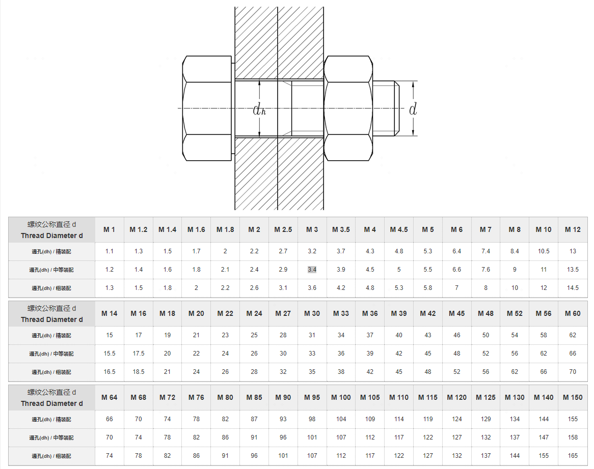

# PCB设计基本知识

## 单位转换

1 Inch英寸 = 1000 mil（1inch=2.54cm=25.4mm）

1 盎司 = 0.0014 英寸 = 0.0356 毫米（mm）=35um

| 密尔（mil） | 4 | 8 | 12 | 16 | 20 | 24 |
| :--------: | :--: | :--: | :--: | :--: | :--: | :--: |
| 毫米（mm） | 0.1 | 0.2 | 0.3 | 0.4 | 0.5 | 0.6 |

* 在线计算工具
    * [EDA365在线工具](https://www.eda365.com/eda365libs/edacalc/)
    * [DigiKey 的在线换算器](https://www.digikey.cn/zh/resources/online-conversion-calculators)

## 封装设计

### Allegro 封装要素

* 原点
    * 规则器件：一般在几何中心
    * 接插件：一般设置在1脚处
    * 连接器：如果有定位孔，一般在定位孔中线的中心；如果没有定位孔，一般是在1脚处
* 焊盘（如果焊盘没有序号，就表示原理图不关心这个引脚或者机械孔）
    * 非金属孔可能要加0.3mm的禁布区，避免走线离孔太近，非金属钻孔误差导致线受影响了
    * 除过孔外的插件孔，孔壁有铜或无铜，最小孔做0.5mm（少于这个值可能会油墨堵孔或喷锡堵孔）
* 丝印
    * Package Geometry -> Silkscreen_Top层
    * 一般有丝印框（轮廓丝印）、1脚标识，可能有正负标识、管脚数标识
        * 丝印框（轮廓丝印）应该与元器件轮廓等大，或者丝印比元器件轮廓外扩0.1~0.5mm，以保证丝印与焊盘保持0.15mm的间隙
    * 离焊盘距离大于0.15mm，一般线宽为0.15mm或者0.2mm，不能小于0.127mm
* 装配线
    * Package Geometry -> Assembly_Top层
* 器件封装边界
    * Package Geometry -> Place_Bound_Top层
* 器件封装高度
    * Package Geometry -> Place_Bound_Top
    * 需要选择封装边界才能设置
* 标签
    * 丝印层参考位号
        * Ref Des -> Silkscreen_Top层
        * 一般写REF或U*等
    * 装配层参考位号
        * Ref Des -> Assembly_Top层
        * 一般写REF或U*等
    * 装配类型device
        * Device Type -> Silkscreen_Top层
            * OrCAD Library Builder 17.4生成的文件是在这个层，其他教程是Device Type -> Assembly_Top层
            * Footprint Expert PRO 23生成的文件没有设置Device Type
        * 一般写DEV或DEVTYPE*等
    * Value、Tolerance、Part Number等可以不设置
* 3D封装
* PCB封装的字体大小设置为多少：

| 线宽（mil） | 字长（mil） | 字高（mil） | 备注 |
| :--------: | :--: | :--: | :--: |
| 4 | 25 | 20 | 单板器件/局部布局推荐使用 |
| 5 | 30 | 25 | 常规设计推荐使用 |
| 6 | 45 | 35 | 单板密度较小，有足够摆放空间 |

### Allegro 封装要求

* 网表导入PCB时，第三方网表需要指定PCB封装库文件，并产生device文件；第一方网表只需要psm和pad文件，不需要device文件。

### 钻孔大小与焊盘的要求

* 多层板上的元器件钻孔大小与所选用的元器件引脚尺寸有关，钻孔过小，会影响器件的装插及上锡；钻孔过大，焊接时焊点不够饱满。一般来说，元件孔孔径及焊盘大小的计算方法为：
    * 元件孔的孔径＝元件引脚直径（或对角线）+（10～30mil）
    * 元件焊盘直径≥元件孔直径＋18mil
* 过孔孔径,主要由成品板的厚度决定,对于高密度多层板，一般应控制在板厚:孔径的比值在≤5∶1的范围内。过孔焊盘的计算方法为:
    * 过孔焊盘(VIA PAD)直径≥过孔直径＋12mil

### 阻焊大小与焊盘的要求

* 在阻焊的制程过程中，因为机器的对位偏差，需要"阻焊开窗焊盘大于线路焊盘"（一般整体大0.1-0.2MM左右，即单边外扩0.05-0.1MM）。实际生产中就会出现阻焊开窗把一些焊盘做变形或是偏大，主要体现在：
    * 阻焊开窗底下是独立的线路焊盘时，实际做出来的焊盘形状：线路焊盘的形状
    * 阻焊开窗底下是与线路相连的线路焊盘时，实际做出来的焊盘形状：线路焊盘+相连的小部分线条露铜的形状（阻焊开窗把部分线条露铜的）
    * 阻焊开窗底下是在大铜面上的线路焊盘时，实际做出来的焊盘形状：阻焊开窗焊盘的形状（阻焊开窗把线路焊盘周围的部分铜面露铜从而使焊盘偏大）
* 阻焊层扩展的最小建议是在焊盘的所有侧面（单边）上增加3密耳，这将补偿大约2密耳的错位。
* 我的首选是在大多数项目中将掩膜设为0密耳，原因有两个：
    * 除非我处理的是非常高密度的布局，否则我们用于大多数元件的封装将具有足够大的焊盘，典型的错位量不会显着减少焊盘上的焊接面积。
    * 我已经知道制造商会增加阻焊层的扩展，因为我与有限数量的制造商合作；我知道他们的制造过程，当他们向我发送DFM报告时，我将有机会准确检查他们想要修改的内容。
        * 第2点应该说明您应有一组首选制造/装配公司的原因，并且您应该了解他们的制造过程。我的公司有几个制造伙伴，我们专门用于中低批量的客户项目。我们知道他们的期望以及我们在初始DFM/DFA审查后可能收到的反馈。

#### 阻焊桥的制作

* 对于密集的IC焊盘，为了焊接时减少锡流到另一IC脚引起短路的风险，可以设计阻焊桥（即在两个IC焊盘间印上一层阻焊油墨），结合我司的加工工艺，满足如下条件的可以做阻焊桥：

## PCB走线与过孔的电流承载能力

### 决定电流承载能力的因素

铜箔厚度、走线宽度、温升、镀通孔孔径。在实际设计中，还需要考虑产品使用环境、PCB制造工艺、板材质量等。

#### 铜箔厚度

* 一般对于没有大电流的产品，可以选择表（内）层约17.5μm厚度的铜箔；如果产品有部分大电流，板大小足够，可以选择表（内）层约35μm厚度的铜箔；如果产品大部分信号都为大电流，那么必须选（内）层约70μm厚度的铜箔。

* 对于两层以上的PCB，如果表层和内层铜箔使用相同厚度，相同线径走线的承载电流能力，表层大于内层。
    * 以PCB内外层均使用35μm铜箔为例：内层线路蚀刻完毕后便进行层压，所以内层铜箔厚度是35μm。外层线路蚀刻完毕后需要进行钻孔，由于钻孔后孔不具有电气连接性能，需要进行化学镀铜，此过程是全板镀铜，所以表层铜箔会镀上一定厚度的铜，一般约25μm~35μm之间，因此外层实际铜箔厚度约为52.5μm~70μm。敷铜板供应商的能力不同，铜箔均匀度会有不同，但差异不大，所以对载流的影响可以忽略。

#### 走线宽度

* 走线宽度的设计值和蚀刻后的实际值有一定的偏差，一般允许偏差为+10μm/-60μm。由于走线是蚀刻成型，在走线转角处会有药水残留，所以走线转角处一般会成为最薄弱的地方。这样，在计算有转角走线的载流值时，应将在直线走线上测得的载流值基础上，乘以（W-0.06）/W（W为走线线宽，单位为mm）。

* 多层板走线要把电源层、地层和信号层分开，减少电源、地、信号之间的干扰。相邻两层印制板的线条应尽量相互垂直或走斜线、曲线，不能走平行线，以减少基板的层间耦合和干扰。且导线应尽量走短线，特别是对小信号电路来讲，线越短，电阻越小，干扰越小。同一层上的信号线，改变方向时应避免锐角拐弯。
* 导线的宽窄，应根据该电路对电流及阻抗的要求来确定，尽量加宽电源、地线宽度，最好是地线比电源线宽，它们的关系是：地线＞电源线＞信号线。
    * 通常信号线宽为：0.2~0.3mm（8~12mil），可采用6～10mil，最经细宽度可达0.05~0.07mm；
    * 电源线为1.2~2.5mm（48~100mil），对数字电路的PCB可用宽的地导线组成一个回路, 即构成一个地网来使用(模拟电路的地不能这样使用) ；

* 国际通用PCB制作标准IPC-2221规范给出的线宽计算公式为：
    * $$ I = 0.024 \times dT^{0.44}  \times A^{0.725}\tag{内部走线} $$
    * $$ I = 0.048 \times dT^{0.44}  \times A^{0.725}\tag{外部走线} $$
    * 其中公式中参数含义为：
        * I 为容许通过的最大电流，单位为安培A；
        * 0.024和0.048为修正系数，一般用K表示，内层走线，K=0.024，表层走线，K=0.048；
        * dT为最大温升，单位为摄氏度℃，常见的是10和20；
        * A为走线截面积，截面积等于铜厚乘以线宽，单位为平方mil；

印制板导线与允许通过的电流与电阻的关系如下表（10°温升），如果是外层走线，可减半考虑：

| 允许电流（A） | 0.1 | 0.5 | 1.0 | 1.5 | 2.0 | 3.0 |
| :----------: | :--: | :--: | :--: | :--: | :--: | :--: |
| 余量电流（A） | 0.2 | 0.8 | 1.2 | 2.0 | 2.5 | 3.5 |
| 导线宽度（mil）| 4 | 24 | 40 | 80 | 112 | 175 |
| 导线宽度（mm）| 0.1 | 0.6 | 1.0 | 2.0 | 2.8 | 4.4|
| 导线电阻（Ω/m） | 0.15 | 0.02 | 0.01 | 0.006 | 0.005 | 0.003 |

* 上表比较保守（实际温升偏低），特殊情况，可以通过在线计算器进行计算：
    * [IPC-2152 Calculator](https://resources.altium.com/p/using-ipc-2152-calculator-designing-standards)

#### 温升

* PCB的走线上通过持续电流后会使该走线发热，从而引起持续温升，当温度升高到基材TG温度或高于TG温度，那么可能引起基材起翘、鼓泡等变形，从而影响走线铜箔与基材的结合力，走线翘曲形变导致断裂。
* PCB的走线上通过瞬态大电流后，会使铜箔走线最薄弱的地方短时间来不及向环境传热，近似绝热系统，温度急剧升高，达到铜的熔点温度，将铜线烧毁。

#### 镀通孔孔径

* 镀通孔通过电镀在过孔孔壁上的铜来实现不同层之间的电气连接，由于为整板镀铜，所以对于各个孔径的镀通孔，孔壁铜厚均相同。不同孔径镀通孔的载流能力取决于铜壁周长。

* 行业内电镀铜的前处理，一般会用沉铜工艺和导电胶工艺，相对于导电胶工艺的低沉本高成本的沉铜工艺，PCB的可靠性高一些。
    * 沉铜，也称化学沉铜，其主要原理是采用化学中的置换反应，在孔壁上沉积一层铜，以作为后续电镀铜的导电引线。常规的沉薄铜，它的厚度一般为 0.5μm 左右。沉铜工艺的质量直接关系到生产线路板的品质，是过孔不通，开路不良的主要来源。
    * 沉铜工艺优势：
        * 沉铜采用以活化钯为孔壁铜粘结媒介层，将铜离子以嵌入孔壁的方式，使其牢固的与孔壁树脂及内层铜层连接，增加了抗剥离强度。
        * 可耐高温288C°10秒3次，且可在+125C°和-25C°高低温环境下持续运行并保证通电畅通。
    * 导电胶工艺缺点：
        * 导电胶孔壁/面铜层结合力较差，易导致孔壁铜分离造成孔开路。
        * 在高温高湿环境热胀冷缩下其孔壁铜稳定性较差，影响PCB板使寿命。
* 对比可以看出，沉铜工艺具有更高的可靠性。但由于导电胶工艺成本低（导电胶工艺使用药水比沉铜工艺低10元/平米），很多小型PCB板厂为了追求利润采用导电胶工艺，放弃沉铜工艺。
* 如何辨别PCB板使用的是沉铜工艺，还是导电胶工艺？
    * 从无铜孔孔壁可以来判断，从上面两张图可以看出，沉铜工艺生产的PCB无铜孔孔壁是基材的颜色，而导电膜工艺生产的PCB无铜孔孔壁处有黑色的膜。
* 沉铜是电镀前处理，完成铜厚后，还需要经过板电和图电两次电镀，PCB通孔电镀是非常重要的环节，为实现不同层的电路导通，需要在孔壁镀上导电性良好的金属铜。
    * 孔铜厚度按IPC二级标准，通常一铜（全板电镀）后的铜厚度为6-8μm，二铜（图形电镀）后孔厚度为14-16μm，所以孔铜厚度在20-24μm之间，加上生产过程中微蚀、喷锡等工序的损耗， 最终孔铜就在20μm（0.78mil）左右。
    * 一般生产出来的PCB 的过孔孔壁的镀铜厚度可能上下宽，中间窄，所以最窄的地方极限可能是0.7mil。

* 最小过孔/焊盘（嘉立创）
    * 单双面板：0.3mm(内径)/0.5mm(外径)
    * 多层板：0.15mm(内径)/0.25mm(外径)
    * 外径必须比内径大0.1mm,推荐大0.15mm以上
    * 最小孔推荐0.2mm以上

* 除过孔外的插件孔，孔壁有铜或无铜，最小孔做0.5mm（少于这个值可能会油墨堵孔或喷锡堵孔）

| 过孔孔径（mil） | 10 | 12 | 16 | 20 | 24 | 40 | 80 |
| :----------: | :--: | :--: | :--: | :--: | :--: | :--: | :--: |
| 推荐电流（A） | 1 | 1.2 | 1.4 | 1.5 | 1.6 | 2.3 | 3.6 |

* 常用的过孔，焊盘比过孔大12mil及以上：
    * VIA0402：0.4mm焊盘，0.2mm钻孔，可过电流0.8A，常用于BGA等高密度板；
    * VIA0603：0.6mm焊盘，0.3mm钻孔，可过电流1.2A，常用于普通布线紧张的板；
    * VIA0704：0.7mm焊盘，0.4mm钻孔，可过电流1.4A，常用于地孔或嘉立创打板；
    * 反焊盘设置为23mil或者24mil阻抗的波动最小；
    * 反焊盘尺寸推荐：如果您遵循最佳 DFM 指南，则您的过孔上的焊盘尺寸将足够大，以具有所需的最小环形圈。确保在环形圈尺寸之外留有一些额外的间隙，特别是在出现破裂的情况下。通常建议设置至少 10 mil 间隙，如下所示：

* 我们做PCB 设计时，在处理电源时用大的孔径（16mil、20mil）就好了，可以保证其通流能力。但为什么一般都使用10mil、12mil 过
孔呢？理由有以下几个：
    * 对于常规板，用10mil、12mil 过孔是可以满足其承载电流的能力的。
    * 用10mil、12mil 过孔，在做PCB 设计时，设计效率会更高，方便我们设计。

## 电源层、地层分区及花孔的要求

对于多层印制板来说，起码有一个电源层和一个地层。由于印制板上所有的电压都接在同一个电源层上，所以必须对电源层进行分区隔离，分区线的大小一般采用**20～80mil**的线宽为宜，电压超高，分区线越粗。如下图:

焊孔与电源层、地层连接处，为增加其可靠性，减少焊接过程中大面积金属吸热而产生虚焊，一般连接盘应设计成花孔形状，如下图：

 

与电源层、地层非连接功能的隔离盘应设计为如下形状：

隔离焊盘的孔径≥钻孔孔径+20mil

## 特殊孔

### Mechanical Hole、Tooling Hole、Mounting Hole区别

* 工具孔应该放置在哪里？工具孔放置在面板上而不是电路板上，特别是在将PCB放置在拼板中时。应该注意的是，制造商实际上生产PCB面板，而不是单个PCB板；PCB 工具孔用于辅助制造，因此应将它们放置在面板中。下图显示了如何将工具孔放置在 PCB 面板的工艺边上。

* 有些指南会说工具孔和安装孔是同一回事，但这不一定是真的。主要区别在于电镀：PCB 工具孔是非电镀通孔，而安装孔通常是电镀的。另一个区别是尺寸：PCB 工具孔通常具有一些标准英制或公制尺寸，并且您的制造商可能会推荐特定的 PCB 工具孔尺寸，以便您的电路板无需修改即可投入其流程。安装孔尺寸仅针对用于将电路板安装到其外壳的安装硬件进行标准化。

|  | Mechanical Hole | Tooling Hole | Mounting Hole |
| :----------: | :--: | :--: | :--: |
| 解释 | 机械孔 | 工具孔 | 安装孔 |
| 尺寸 | 可自由设置 | 直径1至3毫米（增量为0.5毫米） | 受限于特定安装硬件的尺寸 |
| 电镀 | 可选 | 非电镀 | 塑料支架不电镀，金属支架电镀 |
| 放置位置 | 可放置为封装定位孔等 | 在板材上沿着边缘放置或放在角落（也可以时工艺边上） | 放置在PCB上，通常靠近边缘或角落 |

* Mechanical Hole 可选择电镀或者非电镀，然后各层Regular Pad和钻孔一样大，Solder Mask可一样大或者稍大0.05mm。
    * 添加到封装后，将序号删除，就会变成MECHANICAL PIN。

### 螺栓或螺钉选用通孔

## 叠层

### 板外形、尺寸、层数的确定

任何一块印制板，都存在着与其他结构件配合装配的问题，所以，印制板的外形与尺寸，必须以产品整机结构为依据。但从生产工艺角度考虑，应尽量简单，一般为长宽比不太悬殊的长方形，以利于装配，提高生产效率，降低劳动成本。
 
层数方面，必须根据电路性能的要求、板尺寸及线路的密集程度而定。对多层印制板来说，以四层板、六层板的应用最为广泛，以四层板为例，就是两个导线层（元件面和焊接面）、一个电源层和一个地层，如下图：

多层板的各层应保持对称，而且最好是偶数铜层，即四、六、八层等。因为不对称的层压，板面容易产生翘曲，特别是对表面贴装的多层板，更应该引起注意。

## 布局布线区域

### 格点设置

* 因为很多封装来源都是公制单位，所以建议用mil单位设置格点，5mil格点（0.127mm）在很多器件（电阻，电容，IC等）布局时都会非常整齐。

* 布局时，格点可以设置大一点，方便对齐，建议设置如下：

* 布线时，建议设置如下：

* 对于BGA，我们可以不设置特殊格点，直接选择扇出，过孔方向选择如下，就可以选择在BGA中间扇出：

### 器件布局的要求

* 电路板上不同组件相临焊盘图形之间的最小间距应在1MM以上。
* 离电路板边缘一般不小于2MM.电路板的最佳形状为矩形，长宽比为3:2或4:3.电路板面尺大于200MM乘150MM时，应考虑电路板所能承受的机械强度。
* 如果打算不加工艺边，就要求长边留3mm以上的区域作为工艺边，即该边布局区域内缩3mm。

### 导线布层、布线区的要求

* 一般情况下，多层印制板布线是按电路功能进行，在外层布线时，要求在焊接面多布线，元器件面少布线，有利于印制板的维修和排故。细、密导线和易受干扰的信号线，通常是安排在内层。大面积的铜箔应比较均匀分布在内、外层，这将有助于减少板的翘曲度，也使电镀时在表面获得较均匀的镀层。为防止外形加工伤及印制导线和机械加工时造成层间短路，内外层布线区的导电图形离板缘的距离应大于50mil（1.27mm），如下图：

* 焊盘、导线、覆铜、与边框线间距关系
    * 焊盘、导线、覆铜与边框线（中心线）锣边CNC成形需>=20mil以上间距；V割成形需>=25mil以上间距，如间距太小，在生产成形过程中会破坏焊盘、导线、覆铜等。

#### 嘉立创工艺要求

* V-CUT(V割)板框线的中心线距离导线的边线或铜皮（焊盘边）的距离不小于0.4mm（默认双面V割，不做单面V割）
* CNC (锣边)板框线的中心线距离导线的边线或铜皮（焊盘边）的距离不小于0.3mm
* 内槽离焊盘/导线的最小距离不得小于0.3mm
* 制作线路采用干膜工艺，为避免干膜碎导致开路的隐患，铺铜尽量铺成实心铜皮。一定要网格铜面的，网格线宽/间距应在0.254mm以上，同网络的两条线夹角间距应在0.254mm以上

### 过孔的间距要求

* 内层过孔边到线路铜面/导线间隙0.2mm以上（插件孔边到线边0.3mm以上），热焊盘（梅花焊盘）焊盘比钻孔大0.5mm，注意热焊盘不要重叠以免开短路
* 过孔孔边与孔边最小间距0.254mm（插件孔0.45mm），避免因孔间距过近，导致钻孔时断钻头和塞孔导致的孔内无铜现象
* 多层PCB板、高速PCB板孔到孔、孔到线间距：
    * 多层板内层孔到线到铜：
        * 4层:可以不用理会
        * 6层：≥6mil
        * 8层：≥7mil
        * 10层或10层以上：≥8mil
    * 过孔内径边缘间距：
        * 同网络过孔：≥8mil(0.2mm)
        * 不同网络过孔：≥12mil(0.3mm)

### PCB设计之3W原则

* 在PCB设计中为了减少线间串扰，应保证线间距足够大，当线中心间距不少于3倍线宽时，则可保持大部分电场不互相干扰，这就是3W原则。
* 满足3W原则能使信号间的串扰减少70%，而满足10W则能使信号间的串扰减少近98%。
* W原则虽然易记，但要强调一点，这个原则成立是有先前条件的。从串扰成因的物理意义考量，要有效防止串扰，该间距与叠层高度、导线线宽相关。对于四层板，走线与参考平面高度距离(5~10mils)，3W是够了；但兩层板，走线与参考层高度距离(45~55mils)，3W对高速信号走线可能不够。3W原则一般是在50欧姆特征阻抗传输线条件下成立。
* 3W原则是指多个高速信号线长距离走线的时候，其间距应该遵循3W原则，例如时钟线，差分线，视频、音频信号线，复位信号线及其他系统关键电路需要遵循3W原则，而并不是板上所有的布线都要强制符合3W原则。

### PCB设计中的20H原则

* 20H原则是指电源层相对地层内缩20H的距离，当然也是为抑制边缘辐射效应。在板的边缘会向外辐射电磁干扰。将电源层内缩，使得电场只在接地层的范围内传导。有效的提高了EMC。
* 若内缩20H则可以将70%的电场限制在接地边沿内；内缩100H则可以将98%的电场限制在内。
* 20H规则的采用是指要确保电源平面的边缘要比0V平面边缘至少缩入相当于两个平面间层距的20倍。这个规则经常被要求用来作为降低来自0V/电源平面结构的侧边射击发射技术（抑制边缘辐射效应）。
* 20H规则仅在某些特定的条件下才会提供明显的效果。这些特定条件包括有：
    * 在电源总线中电流波动的上升/下降时间要小于1ns。
    * 电源平面要处在PCB的内部层面上，并且与它相邻的上下两个层面都为0V平面。这两个0V平面向外延伸的距离至少要相当于它们各自与电源平面间层距的20倍。
    * 在所关心的任何频率上，电源总线结构不会产生谐振。
    * PCB的总导数至少为8层或更多。

## 去耦电容

* 尖峰电流的抑制方法：
    * 在电路板布线上采取措施，使信号线的杂散电容降到最小；
    * 另一种方法是设法降低供电电源的内阻，使尖峰电流不至于引起过大的电源电压波动；
    * 通常的作法是使用去耦电容来滤波；
        * 一般是在电路板的电源入口处放一个1uF～10uF的去耦电容，滤除低频噪声；在电路板内的每一个有源器件的电源和地之间放置一个0.01uF～0.1uF的去耦电容（高频滤波电容），用于滤除高频噪声。滤波的目的是要滤除叠加在电源上的交流干扰，但并不是使用的电容容量越大越好，因为实际的电容并不是理想电容，不具备理想电容的所有特性。
* 去耦电容的选取可按C=1/F计算，其中F为电路频率，即10MHz取0.1uF，100MHz取0.01uF。一般取0.1~0.01uF均可。
* 放置在有源器件傍的高频滤波电容的作用有两个，其一是滤除沿电源传导过来的高频干扰，其二是及时补充器件高速工作时所需的尖峰电流。所以电容的放置位置是需要考虑的。
* 实际的电容由于存在寄生参数，可等效为串联在电容上的电阻和电感，将其称为等效串联电阻（ESR）和等效串联电感（ESL）。这样，实际的电容就是一个串联谐振电路。
    * 实际的电容在低于Fr的频率呈现容性，而在高于Fr的频率上则呈现感性，所以电容更象是一个带阻滤波器。10uF的电解电容由于其ESL较大，Fr小于1MHz，对于50Hz这样的低频噪声有较好的滤波效果，对上百兆的高频开关噪声则没有什么作用。电容的ESR和ESL是由电容的结构和所用的介质决定的，而不是电容量。通过使用更大容量的电容并不能提高抑制高频干扰的能力，同类型的电容，在低于Fr的频率下，大容量的比小容量的阻抗小，但如果频率高于Fr，ESL决定了两者的阻抗不会有什么区别。
    * 电路板上使用过多的大容量电容对于滤除高频干扰并没有什么帮助，特别是使用高频开关电源供电时。另一个问题是，大容量电容过多，增加了上电及热插拔电路板时对电源的冲击，容易引起如电源电压下跌、电路板接插件打火、电路板内电压上升慢等问题。
* PCB布局时去耦电容摆放
    * 对于电容的安装，首先要提到的就是安装距离。容值最小的电容，有最高的谐振频率，去耦半径最小，因此放在最靠近芯片的位置。容值稍大些的可以距离稍远，最外层放置容值最大的。但是，所有对该芯片去耦的电容都尽量靠近芯片。
* 电容的安装
    * 在安装电容时，要从焊盘拉出一小段引出线，然后通过过孔和电源平面连接，接地端也是同样。这样流经电容的电流回路为：电源平面-》过孔-》引出线-》焊盘-》电容-》焊盘-》引出线-》过孔-》地平面，下图直观的显示了电流的回流路径。
    * 第一种方法从焊盘引出很长的引出线然后连接过孔，这会引入很大的寄生电感，一定要避免这样做，这是最糟糕的安装方式。
    * 第二种方法在焊盘的两个端点紧邻焊盘打孔，比第一种方法路面积小得多，寄生电感也较小，可以接受。
    * 第三种在焊盘侧面打孔，进一步减小了回路面积，寄生电感比第二种更小，是比较好的方法。
    * 第四种在焊盘两侧都打孔，和第三种方法相比，相当于电容每一端都是通过过孔的并联接入电源平面和地平面，比第三种寄生电感更小，只要空间允许，尽量用这种方法。
    * 最后一种方法在焊盘上直接打孔，寄生电感最小，但是焊接是可能会出现问题，是否使用要看加工能力和方式。
    * 推荐使用第三种和第四种方法。
    * 需要强调一点：有些工程师为了节省空间，有时让多个电容使用公共过孔，任何情况下都不要这样做。最好想办法优化电容组合的设计，减少电容数量。

* 由于印制线越宽，电感越小，从焊盘到过孔的引出线尽量加宽，如果可能，尽量和焊盘宽度相同。这样即使是0402封装的电容，你也可以使用20mil宽的引出线。引出线和过孔安装如图4所示，注意图中的各种尺寸。

## 缝合过孔

* 当以提供屏蔽为目的使用时，设计人员有可能只是猜测过孔之间所需的间距。在某些情况下，我们所说的波导屏蔽最好称为电场约束。不管您想怎么称呼它，缝合过孔都可以阻止电磁波传播到某个最大频率。对于要抑制的给定频率，过孔之间的间距应约为：
    * $$ L < \frac{c}{8f\sqrt{DK}} \tag{缝合过孔} $$
    * 如间距为20密耳，根据上述等式，这适用于屏蔽高达43GHz的频率。
* 这种专门用于阻挡电磁波传播的缝合过孔的间距要求与用于将波限制在PCB上的波导内的要求相同。

## 安全间距的要求

### PCB Layout 爬电距离与电气间隙的确定方法

* 电气间隙：在两个导电零部件之间或导电零部件与设备防护界面之间测得的最短空间距离。即在保证电气性能稳定和安全的情况下，通过空气能实现绝缘的最短距离。

* 爬电距离：沿绝缘表面测得的两个导电零部件之间或导电零部件与设备防护界面之间的最短路径。即在不同的使用情况下，由于导体周围的绝缘材料被电极化，导致绝缘材料呈现带电现象。此带电区（导体为圆形时，带电区为环形）的半径，即为爬电距离。
    * 在绝缘材料表面会形成泄漏电流路径。若这些泄漏电流路径构成一条导电通路，则出现表面闪络或击穿现象。绝缘材料的这种变化需要一定的时间，它是由长时间加在器件上的工作电压所引起的，器件周围环境的污染能加速这一变化。

* 爬电距离：
    * 输入电压50V-250V时，保险丝前L—N≥2.5mm;
    * 输入电压250V-500V时，保险丝前L—N≥5.0mm;
* 电气间隙：
    * 输入电压50V-250V时，保险丝前L—N≥1.7mm;
    * 输入电压250V-500V时，保险丝前L—N≥3.0mm；
    * 保险丝之后可不做要求，但尽量保持一定距离以避免短路损坏电源；
* 一次侧交流对直流部分≥2.0mm；
* 一次侧直流地对地≥4.0mm如一次侧地对大地；
* 一次侧对二次侧≥6.4mm，如光耦、Y电容等元器零件脚间距≤6.4mm要开槽；
* 变压器两级间≥6.4mm以上，≥8mm加强绝缘。

| 电压范围（V） | 小于30 | 30-50 | 50-100 | 100-200 | 200-300 | 300-400 | 400-600 | 600-1000 |
| :----------: | :--: | :--: | :--: | :--: | :--: | :--: | :--: | :--: |
| 推荐最小爬电距离（mm） | 0.3 | 0.8 | 1.0 | 1.5 | 2.0 | 2.5 | 3.2 | 5.0 |

* 线间距:
    * 当为1.5MM(约为60MIL)时,线间绝缘电阻大于20M欧,线间最大耐压可达300V;
    * 当线间距为1MM(40MIL)时,线间最大耐压为200V,因此,在中低压(线间电压不大于200V)的电路板上,线间距取1.0--1.5MM (40--60MIL);
    * 在低压电路,如数字电路系统中,不必考虑击穿电压,只要生产工艺允许,可以很小;

## PCB外协加工要求

* 在PCB导出GERBER时，导出数据建议采用RS274X格式，因为它有如下优点：CAM系统能自动录入数据，整个过程不须人工参与，可避免许多麻烦，同时能保持很好的一致性，减少出差率。
    * 嘉立创Gerber文件（只接受RS-274-X格式，不支持Gerber X2 Files及RS-274-D格式）
* 阻抗下单说明
    * **需要做阻抗管控的，一定要把您的阻抗要求以"表格"或"图示"的方法，连同PCB文件一起压缩下单**
    * 重要提醒：下单系统"阻抗管控"选择"+/-10%"的，我们工厂会按这个公差选项来管控阻抗的。选择"无要求"或"+/-20%"的，我们不管控阻抗，只管控线宽线隙在+/-20%公差内（双面板暂时也不管控阻抗）

* 工程设计默认为≤0.50mm都是为过孔，导致成品板孔径偏小.对客户端、PCB工厂都造成很大的困扰，
    * 建议客户：
        * 插件孔〉0.6mm.
        * 如有≤0.50mm的插件孔，请下单备注：有≤0.50mm的插件孔